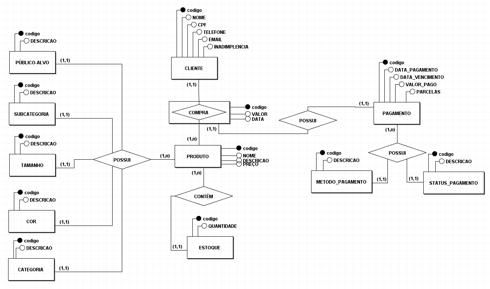
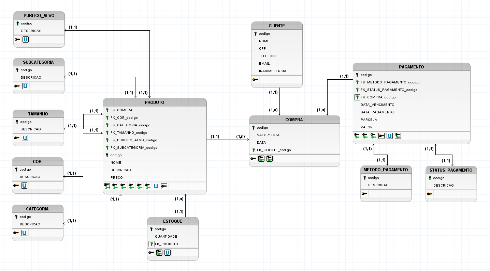

# 🗃️ TRABALHO 01: Sistema de Loja de Roupas & Calçados: Moda Mania - Grupo 5
*Este repositório tem por objetivo armazenar os arquivos elaborados em função do Trabalho I da disciplina de Banco de Dados [2024/1], ministrada pelo Prof. Moisés Omena. Acesse o Jupyter Notebook do trabalho [**aqui**](https://colab.research.google.com/drive/1-Sv9sEFtgHFk4QIsP7sj3-dh5XXw5Ugz?usp=sharing).*

# 1. COMPONENTES
- Alex Rossoni - [@alexrossoni](https://github.com/alexrossoni/)
- João Pedro Pagotto - [@JoaoPPagotto](https://github.com/JoaoPPagotto/)
- Sofia de Alcantara - [@sofialctv](https://github.com/sofialctv/)
- Thiago Carvalho - [@guinho0](https://github.com/guinho0/)
- Wal Candeia - [@OnllyWal](https://github.com/OnllyWal/)

# 2. MINI-MUNDO
O sistema proposto para a loja de roupas e calçados ModaMania conterá as informações aqui detalhadas. Dos produtos serão armazenados o código, nome, descrição, tamanho (PP, P, M, G, GG, etc), cor, categoria (roupa ou calçado) e subcategoria (feminino ou masculino), público-alvo (adulto ou infantil), quantidade em estoque e preço. Cada categoria pode ter várias subcategorias e produtos a ela associados.

Os dados relativos aos clientes que serão armazenados incluem o código do cliente, nome, data de nascimento, CPF, telefone e e-mail. Cada cliente pode realizar várias compras. As compras armazenarão o código da compra, data, valor total e os produtos comprados, com suas respectivas quantidades. Cada compra está associada a um único cliente, mas um cliente pode realizar múltiplas compras.

Os dados do caixa incluirão informações sobre os pagamentos realizados. Cada pagamento armazenará o código do pagamento, o código da compra associada, a data do pagamento e vencimento, o valor pago e o método de pagamento (dinheiro, cartão de crédito, cartão de débito ou PIX). Cada compra pode ter múltiplos pagamentos associados, especialmente em casos de parcelamento, mas um pagamento está sempre vinculado a uma única compra. Além disso, os pagamentos são atribuídos a status como PAGO, EM ANDAMENTO ou ATRASADO. Para melhor controle do comportamento dos cliente, a loja ModaMania faz um controle de clientes com inadimplência ou não.

# 3. RELATÓRIOS
A loja ModaMania demanda os seguintes relatórios podem ser propostos:

1. **Relatório de Vendas por Categoria e Subcategoria**
Este relatório exibirá o total de vendas (em quantidade e valor) para cada categoria (roupa ou calçado) e suas respectivas subcategorias (blusa e camiseta, calça, moletom, bota, chinelo, etc.). Informações incluídas: Categoria, Subcategoria, Quantidade Vendida, Valor Total Vendido, Data da Venda.

2. **Relatório de Estoque**
Este relatório apresentará a quantidade atual de cada produto em estoque, categorizado por tamanho, cor, público-alvo e gênero Informações incluídas: Código do Produto, Nome do Produto, Tamanho, Cor, Público-Alvo, Gênero, Quantidade em Estoque, Preço.

3. **Relatório de Compras por Cliente**
Este relatório listará todas as compras realizadas por cada cliente, incluindo detalhes dos produtos comprados e os valores totais de cada compra. Informações incluídas: Código do Cliente, Nome do Cliente, Código da Compra, Data da Compra, Produtos Comprados (com Quantidades), Valor Total da Compra.

4. **Relatório de Pagamentos e Inadimplência**
Este relatório mostrará o status dos pagamentos realizados pelos clientes, destacando os pagamentos em andamento, pagos e atrasados. Incluirá uma seção específica para clientes inadimplentes. Informações incluídas: Código do Pagamento, Código da Compra, Data do Pagamento, Data de Vencimento, Valor Pago, Método de Pagamento, Status do Pagamento, Código do Cliente, Nome do Cliente.

5. **Relatório de Desempenho de Vendas por Período**
Este relatório fornecerá uma análise das vendas em diferentes períodos, como mensal, trimestral e anual, ajudando a identificar tendências e sazonalidades nas vendas. Informações incluídas: Período (Mês/Trimestre/Ano), Quantidade Vendida, Valor Total Vendido, Categoria, Subcategoria, Público-Alvo, Gênero.
    
# 4. MODELAGEM DO SISTEMA
## 4.1 Modelo Conceitual


### 4.1.1 Dicionário de dados 
- **PÚBLICO-ALVO:** Tabela que armazena as informações sobre o público-alvo dos produtos.
    - **DESCRICAO:** Campo que armazena a descrição do público-alvo (adulto ou infantil).

- **SUBCATEGORIA:** Tabela que armazena as subcategorias dos produtos.<br>
    - **DESCRICAO:** Campo que armazena a descrição da subcategoria (blusa e camiseta, calça, moletom, etc).

- **TAMANHO:** Tabela que armazena os tamanhos dos produtos.<br>
    - **DESCRICAO:** Campo que armazena a descrição do tamanho (PP, P, M, G, GG, etc).

- **COR:** Tabela que armazena as cores dos produtos.<br>
    - **DESCRICAO:** Campo que armazena a descrição da cor dos produtos.

- **CATEGORIA:** Tabela que armazena as categorias dos produtos.<br>
    - **DESCRICAO:** Campo que armazena a descrição da categoria (roupa ou calçado).

- **CLIENTE:** Tabela que armazena as informações relativas aos clientes.<br>
    - **NOME:** Campo que armazena o nome do cliente.<br>
    - **CPF:** Campo que armazena o número de Cadastro de Pessoa Física do cliente.<br>
    - **TELEFONE:** Campo que armazena o número de telefone do cliente.<br>
    - **EMAIL:** Campo que armazena o e-mail do cliente.<br>
    - **INADIMPLENCIA:** Campo que indica se o cliente está inadimplente.

- **COMPRA:** Tabela que armazena as informações sobre as compras realizadas pelos clientes.<br>
    - **VALOR:** Campo que armazena o valor total da compra.<br>
    - **DATA:** Campo que armazena a data da compra.

- **PRODUTO:** Tabela que armazena as informações dos produtos.<br>
    - **NOME:** Campo que armazena o nome do produto.<br>
    - **DESCRICAO:** Campo que armazena a descrição do produto.<br>
    - **PRECO:** Campo que armazena o preço do produto.

- **ESTOQUE:** Tabela que armazena as informações sobre o estoque dos produtos.<br>
    - **QUANTIDADE:** Campo que armazena a quantidade de produtos em estoque.

- **PAGAMENTO:** Tabela que armazena as informações sobre os pagamentos realizados.<br>
    - **DATA_PAGAMENTO:** Campo que armazena a data do pagamento.<br>
    - **DATA_VENCIMENTO:** Campo que armazena a data de vencimento do pagamento.<br>
    - **VALOR_PAGO:** Campo que armazena o valor pago.<br>
    - **PARCELAS:** Campo que armazena o número de parcelas do pagamento.

- **METODO_PAGAMENTO:** Tabela que armazena os métodos de pagamento disponíveis.<br>
    - **DESCRICAO:** Campo que armazena a descrição do método de pagamento (dinheiro, cartão de crédito, cartão de débito ou PIX).

- **STATUS_PAGAMENTO:** Tabela que armazena os status dos pagamentos.<br>
    - **DESCRICAO:** Campo que armazena a descrição do status do pagamento (PAGO, EM ANDAMENTO, ATRASADO).

## 4.2 Modelo Lógico


## 4.3 Modelo Físico
- 📂 [Modelo Físico](/modelo-fisico/)
- 📙 Acesse o Jupyter Notebook online [**aqui**](https://colab.research.google.com/drive/1-Sv9sEFtgHFk4QIsP7sj3-dh5XXw5Ugz?usp=sharing)

# 5. MANIPULANDO O BANCO DE DADOS
## 5.1 INSERT
**a) Script das instruções relativas a inclusão de dados** 
📂 [INSERTS.sql](/modelo-fisico/INSERTS.sql)

# 6	TABELAS E PRINCIPAIS CONSULTAS
- 📙 Acesse o Jupyter Notebook online [**aqui**](https://colab.research.google.com/drive/1-Sv9sEFtgHFk4QIsP7sj3-dh5XXw5Ugz?usp=sharing)
```
# RELATIVAS AO ITEM:
    Público alvo
    Subcategoria
    Tamanho
    Cor
    Categoria
    Produto

# RELATIVAS AO CLIENTE:
    Cliente

# RELATIVAS AO ATO DE COMPRA:
    Compra
    Compra do Item
    Método de Pagamento
    Status de Pagamento
    Pagamento
```

## 6.1	CONSULTAS DAS TABELAS COM TODOS OS DADOS INSERIDOS (Todas)
📂 [SELECTS.sql](/modelo-fisico/SELECTS.sql)

## 6.2	CONSULTAS DAS TABELAS COM FILTROS WHERE (Mínimo 4)
📂 [WHERE.sql](/modelo-fisico/INSERTS.sql)

## 6.3	CONSULTAS QUE USAM OPERADORES LÓGICOS, ARITMÉTICOS E TABELAS OU CAMPOS RENOMEADOS (Mínimo 11)
    a) Criar 5 consultas que envolvam os operadores lógicos AND, OR e Not
    b) Criar no mínimo 3 consultas com operadores aritméticos 
    c) Criar no mínimo 3 consultas com operação de renomear nomes de campos ou tabelas

📂 [LOGICAL.sql](/modelo-fisico/LOGICAL.sql)

## 6.4	CONSULTAS QUE USAM OPERADORES LIKE E DATAS (Mínimo 12)
    a) Criar outras 5 consultas que envolvam like ou ilike
    b) Criar uma consulta para cada tipo de função data apresentada.

📂 [LIKE-DATAS.sql](/modelo-fisico/LIKE-DATAS.sql)

## 6.5	INSTRUÇÕES APLICANDO ATUALIZAÇÃO E EXCLUSÃO DE DADOS (Mínimo 6)
    a) Criar minimo 3 de exclusão
    b) Criar minimo 3 de atualização

## 6.6	CONSULTAS COM INNER JOIN E ORDER BY (Mínimo 6)
    a) Uma junção que envolva todas as tabelas possuindo no mínimo 2 registros no resultado
    b) Outras junções que o grupo considere como sendo as de principal importância para o trabalho

## 6.7	CONSULTAS COM GROUP BY E FUNÇÕES DE AGRUPAMENTO (Mínimo 6)
    a) Criar minimo 2 envolvendo algum tipo de junção

## 6.8	CONSULTAS COM LEFT, RIGHT E FULL JOIN (Mínimo 4)
    a) Criar minimo 1 de cada tipo

## 6.9	CONSULTAS COM SELF JOIN E VIEW (Mínimo 6)<br>
    a) Uma junção que envolva Self Join (caso não ocorra na base justificar e substituir por uma view)
    b) Outras junções com views que o grupo considere como sendo de relevante importância para o trabalho

## 6.10	SUBCONSULTAS (Mínimo 4)<br>
    a) Criar minimo 1 envolvendo GROUP BY
    b) Criar minimo 1 envolvendo algum tipo de junção

# 7 RELATÓRIOS E GRÁFICOS

a) análises e resultados provenientes do banco de dados desenvolvido (usar modelo disponível)

b) link com exemplo de relatórios será disponiblizado pelo professor no AVA

``` 
OBS: Esta é uma atividade de grande relevância no contexto do trabalho. Mantenha o foco nos 5 principais relatórios/resultados visando obter o melhor resultado possível
```


# 8	VÍDEO PARA APRESENTAÇAO FINAL

#### a) Modelo (pecha kucha)
#### b) Tempo de apresentação 6:40 